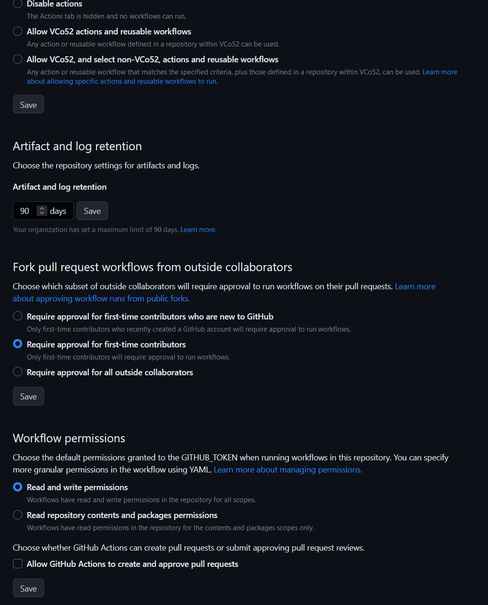

# Automatisierung von gh-deploy
## Ausgangssituation (IST)
Eine in einem GitHub-Repo gespeicherte MKDocs Webseite wird mithilfe des 'mkdocs.exe gh-deploy'-Befehls in eine GitHub-Pages kompatible Version umgewandelt und auf dem Branch 'gh-pages' hochgeladen. Jedes mal, wenn eine Änderung der Webseite erfolgt, wird der Befehl erneut ausgeführt und so die Webseite auf GitHub-Pages aktualisiert.

## Ziel (SOLL)
Nach jeder Änderung im GitHub-Repository soll die Webseite automatisch aktualisiert werden.

## Umsetzung des Ziels mittels GitHub Actions
1. Lese/Schreib Zugriff für GitHub-Actions Bot erlauben
    1. GitHub Repo > Einstellungen > Actions > Allgemein > Workflow Berechtigungen aus Lese/Schreib Zugriff erlauben

2. Anlegen der Datei .github/workflows/gh-deploy.yml
3. konfigurieren der GitHub-Action:
```
00 name: gh-deploy 
01 on:
02   push:
03     branches:
04       - main
05 jobs:
06   deploy:
07     runs-on: ubuntu-latest
08     steps:
09       - uses: actions/checkout@v2
10       - uses: actions/setup-python@v2
11         with:
12           python-version: 3.x
13       - run: pip install mkdocs-material 
14       - run: mkdocs gh-deploy --force
```
4. Änderungen committen und pushen

Die oben erstellte gh-deploy.yml installiert, nach jedem Push auf dem Branch 'main', Python und mkdocs in einer Ubuntu Umgebung. Anschließend führt sie den gh-deploy Befehl aus.

| Linie | Beschreibung                                                                                                                              |
|-------|-------------------------------------------------------------------------------------------------------------------------------------------|
| 1-4   | Auführung bei Push auf 'main'-Branch                                                                                                      |
| 9-10  | Führt von GitHub vordefinierte Befehle aus: - checkout: macht das Repository für die Action verwendbar - setup-python: installiere Python |
| 12    | benutze/installiere Python Version 3 im 'setup-python' Befehl                                                                             |
| 13    | installiere das pip(Python) modul 'mkdocs-material'                                                                                       |
| 14    | führe den 'mkdocs gh-deploy'-Befehl aus                                                                                                   |
